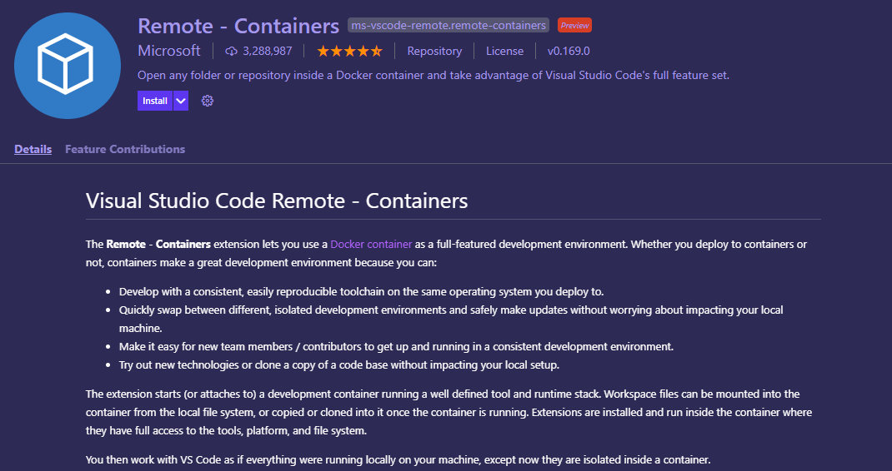
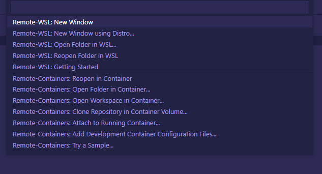
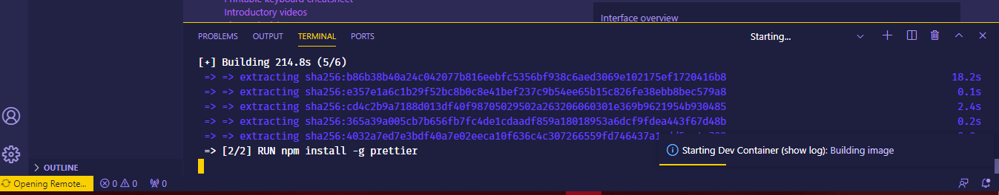

<div align="center">
	<h1>Dockerize your local React Dev Environment<br><br><br>
	
	</h1>
</div>

## 👉 FEATURES
- Shades of Purple Extention
- Prettier
- Remote container build
- Docker local container

##  INSTALLATION

```
git clone https://github.com/saadhaxxan/Dockerize-react-nodejs-vscode
cd Dockerize-react-nodejs-vscode
```

# Configuring Docker Container in VS-CODE

### Install the following extention
<br>
<div align="center">
	
</div>

### Open Command pallete and select option (Reopen in Container)
<br>
<div align="center">
  	
</div>	


### Container Building and Running
<br>
<div align="center">
	
</div>

## Author
You can get in touch with me on my LinkedIn Profile:

#### Saad Hassan
[](https://www.linkedin.com/in/saadhaxxan)

You can also follow my GitHub Profile to stay updated about my latest projects: [](https://github.com/saadhaxxan)

If you liked the repo then kindly support it by giving it a star ⭐!

If you find any bug in the code or have any improvements in mind then feel free to generate a pull request.

## LICENSE
- MIT (2021)
